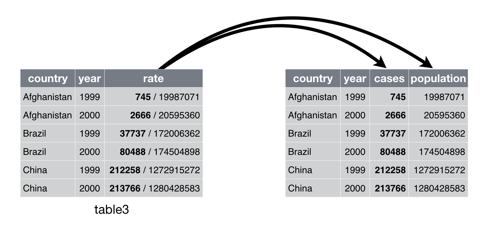
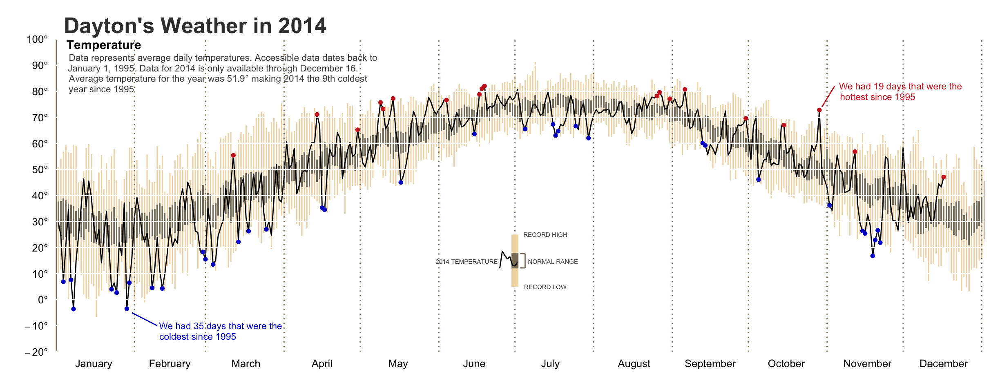

```{r setup, include=FALSE}
knitr::opts_chunk$set(message = FALSE)
knitr::opts_chunk$set(warning = FALSE)
library(tidyverse)
library(DBI)
library(gapminder)
library(readxl)
library(httr)
library(jsonlite)
library(nycflights13)
data(diamonds)
data(iris)
```

# Introduction

## About myself

- Head of Data at Looping Studios since 2018
- Postdoc at Hertie 2015-2017 (Governance Report)
- PhD in PolSci (University of Mannheim)
- Research on parties, legislative politics, electoral behavior
- First started programming in 2011

**Contact**:

- <a href="mailto:haber.matthias@gmail.com"><i class="fa fa-envelope"></i> haber.matthias@gmail.com</a>

## About yourself
- Who are you?
- Why did you take this class?
- What data/programming skills would make you work life easier? 

## Survey results

```{r, echo = F, warning = F, message = F}
library(tidyverse)
library(scales)
library(hrbrthemes)
library(plotly)
input <- read.csv("data/questionnaire.csv")


ggplotly(input %>%
  ggplot(aes(x=programming)) +
  geom_bar(aes(y = (..count..)/sum(..count..)), fill = "darkblue") +
  scale_x_continuous(breaks = c(1,2)) +
  scale_y_continuous(labels = scales::percent_format()) +
  theme_modern_rc(grid = "Y") +
    labs(title = "Prior programming experience: 1 (Awareness) - 5 (Advanced)",
       x = "", y = "") +
  theme(panel.background = element_rect(fill = "transparent"),
    plot.background = element_rect(fill = "transparent", color = NA))
)
```

## Survey results

```{r, echo = F, warning = F, message = F}
library(tidyverse)
library(scales)
library(hrbrthemes)
library(plotly)
input <- read.csv("data/questionnaire.csv")

ggplotly(input %>% tidyr::gather(task, value, import:sql) %>% 
  ggplot(aes(x=task, y = value, fill = task)) +
    geom_boxplot() +
    theme_modern_rc(grid = "Y") +
    labs(title = "Skill needed in job",
       x = "", y = "") +
    scale_fill_ipsum() +
    theme(panel.background = element_rect(fill = "transparent"),
      plot.background = element_rect(fill = "transparent", color = NA),
      legend.position = "none")
)
```

## Workshop structure


- Day 1
  - Session 1: A basic introduction to R
  - Session 2: Programming
  - Session 3: Tidyverse
  - Session 4: Visualization

- Day 2
  - Session 1: Creating our own dataset
  - Session 2: Dashboard fundamentals
  - Session 3: Building our own dashboard
  - Session 4: Moving deeper and further


## Why data skills?

- Data skills are increasingly important for research and industry projects
- With complex data  projects, however, come complex needs for understanding and communicating processes and results

**The 80-20 rule**

- Most data are messy

    + You spent most of your time cleaning/preparing data
    + You learn lot about the structure of your data

## R
- Based on the statistical programming language S (1976)
- R was developed by Ross Ihaka and Robert Gentleman (1995)
- R was intentionally developed to be a data analysis language

## Why R

- Open source: makes it highly customizable and easily extensible
- Over 7,500 packages and counting
- Used by many social scientists interested in data analysis
- Powerful tool to generate elegant and effective plots
- Command-line interface and scripts favors reproducibility
- Excellent documentation and online help resources

## We will work in RStudio

- RStudio is an Integrated Developer Environment (IDE) and serves as: 

- Code editor

    + Code highlighting/completion, indentation, …
    + Feed code from editor to R-console
    
- Project manager
- Workspace viewer
- Data browser
- Enhanced output viewer
- Help browser

## Install software

- R:

    + R: <http://cran.rstudio.com/>
    + RStudio: <http://www.rstudio.org/download/daily/desktop/>

- R packages

    + tidyverse (R packages designed for data science)

# Session 1: A basic introduction to R

## The RStudio Interface

```{r, out.width = "700px", echo = F, fig.align='center'}
knitr::include_graphics("img/rstudio.png")
```

## Basic workflow
- Edit in code editor (.r-file)
- Paste to console
- Save Workspace/Datasets (.Rdata-file)
- Save code routinely (no auto-save!)
- Press TAB to use RStudio's autocompletion feature

## Shortcuts

- Run code from editor: Select line and ctrl+Enter
- Switch between source and console: ctrl+1, ctrl+2
- Clear console: ctrl+L
- 'Arrow up' gives you the last line of code in the console
- Press Alt+Shift+K to see all keyboard shortcuts

## Fundamentals of the R language

- Use # to comment code (will not be run)
- Case-sensitivity: ```data``` vs ```Data```
- Assigning objects: <- and =

```{r, echo = T}
# Assign the number 5 to an object called number
number <- 5
number
```

```{r, echo = T}
# Assign the character string Hello World
string <- "Hello World"
string
```    

## Naming

- object names must start with a letter, and can only contain letters, numbers, `_` and `.`.
- object names should be descriptive
- Each object name must be unique in an environment.

    + Assigning something to an object name that is already in use will overwrite the object's previous contents.

```{r, eval = FALSE, echo=TRUE}
i_use_snake_case
otherPeopleUseCamelCase
some.people.use.periods
And_aFew.People_RENOUNCEconvention
```

## Functions

- Functions perform operations on the input given and end in ()

- R has a large collection of built-in functions that are called like this:

```{r eval = FALSE, echo=TRUE}
function_name(arg1 = val1, arg2 = val2, ...)
```

## Functions 

- For example, `seq()` which makes regular **seq**uences of numbers
```{r}
seq(1,10)
```

## Operations on scalars

You can use R as a calculator:
```{r, echo = T, eval=F}
2 + 3
2 - 3
2 * 3
2 / 3
```

Functions on scalars: 
```{r, echo = T}
a <- 5
factorial(a)
```


## Exercise

1. Do the following calculation in R: $\frac{1+5}{9}$
2. Assign the results to a variable
3. Bonus: Round off the results to the 1 decimal


## Special values in R

- `NA`: not available, missing
- `NULL`: does not exist, is undefined
- `TRUE`, `T`: logical true
- `FALSE`, `F`: logical false


## Finding special values

| Function  | Meaning              |
| --------- | -------------------- |
| `is.na`   | Is the value `NA`    |
| `is.null` | Is the value `NULL`  |
| `isTRUE`  | Is the value `TRUE`  |
| `!isTRUE` | Is the value `FALSE` |


```{r, echo = T}

absent <- NA
is.na(absent)
```

## Operations

| Operator | Meaning                  |
| -------- | ------------------------ |
| `<`      | less than                |
| `>`      | greater than             |
| `==`     | equal to                 |
| `<=`     | less than or equal to    |
| `>=`     | greater than or equal to |
| `!=`     | not equal to             |
| `a | b`  | a or b                   |
| `a & b`  | a and b                  |

    
## R is object-oriented

Objects are R's nouns and include (not exhaustive):

- character strings
- numbers
- vectors of numbers or character strings
- matrices
- data frames
- lists

## Vectors

A vector is a container of objects put together in an order.
```{r, echo = T}
# Define a vector
a <- c(1,4,5)
b <- c(3,6,7)
```

```{r, echo = T}
# Join multiple vectors
ab <- c(a,b)
```

```{r, echo = T, eval = F}
# Find vector length (number of its elements)
length(a)
```


## Operations on vectors

| Operation     | Meaning                  |
| --------      | ------------------------ |
| `sort(x)`     | sort a vector            |
| `sum(x)`      | sum of vector elements   |
| `mean(x)`     | arithmetic mean          |
| `median(x)`   | median value             |
| `var(x)`      | variance                 |
| `sd(x)`       | standard deviation       |
| `factorial(x)`| factorial of a number    |


## Exercise

1. Create a character vector with the names of the three people sitting closest to you. Save the vector as `name`

2. Create a numeric vector with their respective ages and save it as `age`

3. Use a funtion in R to calculate their average age?

## Matrices

A Matrix is a square 2 dimensional container, i.e. vectors combined by row or column

- Must specify number or rows and columns `matrix(x,nrow,ncol,byrow)`

    + x: vector of length nrow*ncol
    + nrow: number of rows
    + ncol: number of columns
    + byrow: TRUE or FALSE, specifies direction of input


## Exercise

Assign a 6 x 10 matrix with the sequence 1,2,3,…,60 as the data. Save the matrix as `m`


## Data frames

Data frames are a two-dimensional container of vectors with the same length. Each column (vector) can be of a different class and can be referenced or created with `$`. You can use functions like `nrow()`, `ncol()`, `dim()`, `colnames()`, or `rownames()` on your df.

```{r, echo = T, out.width = "200px"}
# Combine two vectors into a data frame
number <- c(1, 2, 3, 4)
name <- c('John', 'Paul', 'George', 'Ringo')
df <- data.frame(number, name, stringsAsFactors = FALSE)
df
```


## Exercise

1. Create a vector called `country` containing the names of the countries from the three people whose names you used earlier.
2. Create a data frame combining `name`, `age`and `country` and save it as `my_first_df` 


## Lists

A list is an object containing other objects that can have different lengths and classes.

```{r, echo = T}
# Create a list with three objects of different lengths
list1 <- list(beatles = c('John', 'Paul', 'George', 'Ringo'),
              alive = c('Paul', 'Ringo'), albums = 1:13)
list1
```

## Exercise

1. Add one more person's name to `name` vector
2. Try to create a data frame called `my_second_df` and store the new `name` vector, `age` and `country` in it. See what happens and why.
3. Create a list instead of a data frame with the three objects and name it `my_first_list`


## Indexing vectors

```{r, out.width = "300px", echo = F, fig.align='center'}

```

## Exercise

1. Return the first number in your vector `age`
2. Return the 2nd and 3rd element in your vector `name`
3. Return only ages under 30 from your vector `age`

## Referencing matrices

- Like vectors, you can reference matrices by elements
- Can also reference rows/columns, these are vectors

```{r, out.width = "300px", echo = F, fig.align='center'}

```

## Exercise

Extract the 9th column of the matrix from the previous problem. How can you find the 4th element in the 9th column?

## Indexing data frames

```{r, out.width = "150px", echo = F, fig.align='center'}
knitr::include_graphics("img/indexing_dataframe.png")
```

```{r, out.width = "150px", echo = F, fig.align='center'}
knitr::include_graphics("img/indexing_dataframes2.png")
```

## Exercise

1. From your data frame `my_first_df`, return the entries for everyone living in a country of your choice.


## Indexing lists

```{r, echo = T}
list1[1] # 1st element of the list
list1[[1]] # 1st content of the first element
list1[[1]][[2]] # 2nd value in the 1st content
```


## Role of brackets

- `[]` for indexing vectors, lists, data frames...
- `()` for passing arguments to functions
- `{}` for defining content of loops, functions, etc.

## Recap types and structures

- Data types encountered so far:
    + `logical`
    + `numeric`
    + `character`

- Data structures
    + `vector` (1 dimension)
    + `matrix` (2 dimensions)
    + `data frame` (2 dimensions)
    + `list` ($n$ dimensions)

- Absent data
    + `NA` (not available)
    + `NUll` (non-existent)

## Recap functions

- Functions encountered so far

    + `c()`
    + `data.frame()`
    + `mean()`
    + ...

- What if you don't know what a functions does?

    + `?mean()` to get help for a function
    + help.search(‘weighted mean’) to get help for a concept
    
    
## Help

```{r, out.width = "700px", echo = F, fig.align='center'}
knitr::include_graphics("img/help1.png")
```

## Help

```{r, out.width = "700px", echo = F, fig.align='center'}

```

## Break

Take a 10 minute break.

# Session 2: Programming

## Things we will cover in this session

1. Writing scripts
2. Programming with functions and loops

## R's build-in data sets
There are a number of example data sets available within `R`.

```{r, echo = T, eval=FALSE}
# List internal data sets:
data()
```

```{r, echo = T, eval = F}
# Load swiss data set:
data(iris)
# Find data description:
?iris
```


## Iris dataset

- Standard dataset in R, measurement on three species of flowers

```{r, out.width = "600px", echo = F, fig.align='center'}
knitr::include_graphics("img/iris.png")
```

## Exercise

1. Explore the `iris` dataset with the following functions:
  - `head()`
  - `tail()`
  - `names()`
  - `summary()`
  - `dim()`
  - `str()`

2. What do those functions tell you about the structure of `iris`?

## Creating an R Script

```{r, out.width = "800px", echo = F, fig.align='center'}

```

## Executing an R Script

- Place the course in the line of code you want to execute
- Press "Run" or `ctrl/command + enter` 
- You can also execute multiple lines by selecting all of them and then pressing "Run"
- Try it out! Enter in your script:


```{r, eval = F}
head(iris)
summary(iris)
```

- Then execute those lines!

## Functions
- In R, you can write functions! They can make your code easier to understand, speed-up reoccurring tasks and help you to avoid making mistakes. However, writing good functions is a lifetime journey.

- Guiding principle: Consider writing a function whenever you’ve copied and pasted a block of code more than twice.

```{r,}
# Find the sample mean of a vector
fun_mean <- function(x){
    sum(x) / length(x)
}
data(swiss)
fun_mean(x = swiss$Infant.Mortality)
```

## Key steps in creating functions

1.  Pick a __name__ for the function. 

1.  List the inputs, or __arguments__, to the function inside `function`.
    A function with just one argument would look like `function(x)`.

1.  Place the code you have developed in __body__ of the function, a 
    `{` block that immediately follows `function(...)`.

Always start with working code and turn it into a function; it's harder to create a function and then try to make it work.

## Exercise

Write a function that takes a number and doubles it.


## Exercise solution

Write a function that takes a number and doubles it.

```{r, echo = T}
double <- function(x){
output <- x * 2
output
}
double(8)
```


## Apply function

- `apply` allows you to apply a function to every row or every column. This can be done with a `for()` loop, but `apply()` is usually much faster and simpler. 

- `apply()` takes the following form: `apply(X, MARGIN, FUN, ...)`.

```{r, echo = T}
m <- matrix(c(1:10, 11:20), nrow = 10, ncol = 2)
# mean of the rows
apply(m, 1, mean)
# mean of the columns
apply(m, 2, mean)
```


## Exercise

Load up the build-in R dataset 'iris' and use `apply()` to get the mean of the first 4 variables.


## Exercise (solution)

Load up the build-in R dataset 'iris' and use `apply()` to get the mean of the first 4 variables.

```{r, echo = T}
attach(iris)
apply(iris[,1:4], 2, mean)
```

## Iterations

- Besides functions, you can also use iterations to reduce duplication in your code by repeating the same operation on different columns, or on different datasets.

- There are two paradigms of iterations in R: 
  - Imperative programming
  - Functional programming

## `For()` loops

- For() loops are used to loop around a vector/matrix to do something.

```{r}
m <- matrix(1:5, nrow=1, ncol=5)
m
for (j in 1:3){
     m[,j]=0
}
m
```


## `For()` loops (II)

You can also 'nest' a `for()` loop in another `for()` loop
```{r, echo = T}
m <- matrix(1:15, nrow=3, ncol=5)
for (i in 1:2){
  for (j in 1:4){
    m[i,j]=0
  }
}
m
```


## Exercise

1. Run the following lines:
```{r}
output <- vector("double", ncol(mtcars))
names(output) <- names(mtcars)
```

2. Write a for loop to compute the mean of every column in the example dataset `mtcars`


## Exercise solution

```{r}
output <- vector("double", ncol(mtcars))
names(output) <- names(mtcars)
for(i in names(mtcars)) {
  output[i] <- mean(mtcars[[i]])
}
output
```


## If() statements 

- `if()` statements are used to make conditions on executing some code. If condition is true, action is done. 

```{r, echo = T}
a <- 3
b <- 4
number <- 0
if(a<b){
  number=number+1
}
number
```

Tests for conditions: `==; >; <; >=; <=; !=`


## Packages

You can greatly expand the number of functions by installing and loading 
user-created packages.

```{r, eval=FALSE}
# Install dplyr package
install.packages('dplyr')
# Load dplyr package
library(dplyr)
```

You can also call a function directly from a specific package with the double
colon operator (`::`).

```{r, eval=FALSE}
Grouped <- dplyr::group_by(iris, Species)
```

## Break

Enjoy your 1 hour lunch break!

# Session 3: Messing with data

## Things we will cover in this session

1. Introduction to `Tidyverse`
2. Loading and saving data
3. Transforming data

## tidyverse

```{r, out.width = "800px", echo = F, fig.align='center'}
knitr::include_graphics("img/tidyverse.png")
```


## Import csv files with `read_csv()`
You can use R's build-in function `read.csv()` but I highly encourage you to use the tidyverse function `read_csv()` instead as it is 10x faster and can guess common formats. 


```{r, echo=T}
potatoes <- read.csv("data/potatoes.csv")
head(potatoes)
```

## Extensions

* `read_csv()`: comma delimited files
* `read_csv2()`: semicolon separated files
* `read_tsv()`: tab delimited files
* `read_delim()`: files with any delimiter

## `read_csv()` skipping lines
You can use `skip = n` to skip the first n lines; or use `comment = "#"` to drop all lines that start with (e.g.) `#`:

```{r, warning=FALSE}
potatoes <- read_csv("data/potatoes.csv", skip = 2)
```

## `read_csv()`

`read_csv()` by default uses the first line of the data for the column names. You can use `col_names = FALSE` to not treat the first row as headings or supply your own column names with `col_names`:

```{r}
read_csv("1,2,3\n4,5,6", col_names = FALSE)
read_csv("1,2,3\n4,5,6", col_names = c("x", "y", "z"))
```

## `read_delim()`
`read_delim()` is the main readr function and takes two mandatory arguments, _file_ and _delim_.

```{r, message=FALSE}
properties <- c("area", "temp", "size", "storage",
                "method", "texture", "flavor",
                "moistness")
potatoes <- read_delim("data/potatoes.txt", delim = "\t",
                       col_names = properties)
```

## Exercise

1. What is wrong with each of the following inline CSV files. 
    
```{r, eval = FALSE}
read_csv("a,b\n1,2,3\n4,5,6")
read_csv("a,b,c\n1,2\n1,2,3,4")
read_csv("a;b\n1;3")
```
    
## Exercise solutions

```{r, eval = FALSE}
# Only two columns are specified in the 
# header “a” and “b”
read_csv("a,b\n1,2,3\n4,5,6")
# There are only two values in row 1, 
# so column c is set to NA
read_csv("a,b,c\n1,2\n1,2,3,4")
# The values are separated by “;” 
# not “,”. Use read_csv2 instead
read_csv("a;b\n1;3")
```
    

## Import Excel files with `readxl()`
The `readxl` package makes it easy to get data out of Excel and into R.
`readxl` supports both .xls format and the modern xml-based .xlsx format.

You can use the `excel_sheets()` function to find out which sheets are available in the workbook. 

```{r}
library(readxl) # not part of core tidyverse
excel_sheets(path = "data/urbanpop.xlsx")
```

## `readxl`
Use `read_excel()` to read in Excel files. You can pass a number (or string) to the `sheet` argument  to import a specific sheet.. 


```{r}
pop1 <- read_excel("data/urbanpop.xlsx", sheet = 1)
pop2 <- read_excel("data/urbanpop.xlsx", sheet = 2)
pop3 <- read_excel("data/urbanpop.xlsx", sheet = 3)

pop <- lapply(excel_sheets(path = "data/urbanpop.xlsx"),
              read_excel, path = "data/urbanpop.xlsx")

```

## `readxl`

You can use `skip` to control which cells are read and `col_names` to set the column names.

```{r}
pop <- read_excel(path = "data/urbanpop.xlsx", sheet=2,
                  skip=21, col_names=FALSE)
```

## Importing data from databases
To import data from a database you first have to create a connection to it. You need different packages depending on the database you want to connect. 

`dbConnect()` creates a connection between your R session and a SQL database. The first argument has to be a `DBIdriver` object, that specifies how connections are made and how data is mapped between R and the database. If the SQL database is a remote database hosted on a server, you'll also have to specify the following arguments in dbConnect(): `dbname`, `host`, `port`, `user` and `password`.

## Establish a connection

```{r}
library(DBI) # not part of core tidyverse
host <- "courses.csrrinzqubik.us-east-1.rds.amazonaws.com" 
con <- dbConnect(RMySQL::MySQL(),
                 dbname = "tweater",
                 host = host, 
                 port = 3306,
                 user = "student",
                 password = "datacamp")
```

## List the database tables
After you've successfully connected to a remote database. you can use `dbListTables()` to see what tables the database contains:

```{r}
tables <- dbListTables(con)
tables
```

## Import data from tables

You can use the `dbReadTable()` function to import data from the database tables. 

```{r}
users <- dbReadTable(con, "users")
users
```

## Import data from tables
Again, you can use lapply to import all tables:

```{r}
tableNames <- dbListTables(con)
tables <- lapply(tableNames, dbReadTable, conn = con)
```

## Exercise
1. Connect to the tweater database using the following function:

```{r, eval = FALSE}
host <- "courses.csrrinzqubik.us-east-1.rds.amazonaws.com" 
con <- dbConnect(RMySQL::MySQL(),
                 dbname = "tweater",
                 host = host, 
                 port = 3306,
                 user = "student",
                 password = "datacamp")
```

The `tweats` table contains a column `user_id`, which refer to the users that have posted the tweat. The `comments` table contain both a `user_id` and a `tweat_id` column. 

## Exercise

2. Who posted the tweat on which somebody commented "awesome! thanks!" (comment 1012)? 
3. Be polite and disconnect from the database afterwards. You do this with the `dbDisconnect()` function.

## Exercise solution
The user with `user_id` 5: Oliver.

```{r}
dbDisconnect(con)
```

## Import files directly from the web
You can use `read_csv` to directly import csv files from the web.

```{r, message=FALSE}
url <- paste0("https://raw.githubusercontent.com/",
"mhaber/AppliedDataScience/master/",
"slides/week2/data/potatoes.csv")
potatoes <- read_csv(url)
```

## Download files
`read_excel()` does not yet support importing excel files directly from the web so you have to download the file first with `download.file()`:

```{r}
url <- paste0("https://github.com/",
"mhaber/AppliedDataScience/blob/master/",
"slides/week2/data/urbanpop.xlsx?raw=true")
download.file(url, "data/urbanpop.xlsx", mode = "wb")
urbanpop <- read_excel("data/urbanpop.xlsx")
```

## `httr`
The `httr` package provides a convenient function `GET()` to download files. The result is a response object, that provides easy access to the content-type and the actual content. You can extract the content from the request using the `content()` function

```{r}
library(httr) # not part of core tidyverse
url <- "http://www.example.com/"
resp <- GET(url)
content <- content(resp, as = "raw")
head(content)
```

## Importing data from other statistical software
We can use `haven()` to read data from other statistical software packages such as SAS, STATA and SPSS.

-  _SAS_: `read_sas()`
-  _STATA_: `read_dta()`
-  _SPSS_: `read_sav()` or `read_por()`, depending on the file type.

All of these functions take the path to your local (or online) file.

## Other data sources: JSON (`jsonlite`)

```{r}
library(jsonlite) # not part of core tidyverse
url <- paste0("http://mysafeinfo.com/api/",
"data?list=englishmonarchs&format=json")
jsonData <- fromJSON(url)
str(jsonData)
```

## Other data sources: Images

* jpeg - [http://cran.r-project.org/web/packages/jpeg/index.html](http://cran.r-project.org/web/packages/jpeg/index.html)
* readbitmap - [http://cran.r-project.org/web/packages/readbitmap/index.html](http://cran.r-project.org/web/packages/readbitmap/index.html)
* png - [http://cran.r-project.org/web/packages/png/index.html](http://cran.r-project.org/web/packages/png/index.html)
* EBImage (Bioconductor) - [http://www.bioconductor.org/packages/2.13/bioc/html/EBImage.html](http://www.bioconductor.org/packages/2.13/bioc/html/EBImage.html)


## Other data sources: Geospatial data

* rgdal - [http://cran.r-project.org/web/packages/rgdal/index.html](http://cran.r-project.org/web/packages/rgdal/index.html)
* rgeos - [http://cran.r-project.org/web/packages/rgeos/index.html](http://cran.r-project.org/web/packages/rgeos/index.html)
* raster - [http://cran.r-project.org/web/packages/raster/index.html](http://cran.r-project.org/web/packages/raster/index.html)

## Other data sources: Music data

* tuneR - [http://cran.r-project.org/web/packages/tuneR/](http://cran.r-project.org/web/packages/tuneR/)
* seewave - [http://rug.mnhn.fr/seewave/](http://rug.mnhn.fr/seewave/)

## Data manipulation with `dplyr`

```{r, out.width = "500px", echo = F, fig.align='center'}
knitr::include_graphics("img/dplyr.png")
```  

## Piping

The pipe operator `%>%` (Ctrl/Cmd+Shift+M) allows you to write code in sequences which has several benefits:

- serves the natural way of reading ("First this, then this, ...")
- avoids nested function calls
- minimizes the need for local variables and function definitions

## Core `dplyr()` functions

- `filter()`: select rows by their values
- `arrange()`: order rows
- `select()`: select columns by their names
- `mutate()`: create new variables
- `summarize()`: collapse many values down to a single summary

- `group_by()`: operate on it group-by-group
- `rename()`: rename columns
- `distinct()`: find distinct rows

## Command structure (for all dplyr verbs):

- first argument is a data frame
- return value is a data frame
- nothing is modified in place

## `filter()`

`filter()` allows to subset observations based on their values. The function takes logical expressions and returns the rows for which all are `TRUE`. 

```{r, out.width = "500px", echo = F, fig.align='center'}
knitr::include_graphics("img/filter.png")
```  

## `filter()`

`filter()` revolves around using comparison operators: 
`>`, `>=`, `<`, `<=`, `!=` (not equal), and `==` (equal).

`dplyr` functions like `filter()` never modify inputs but instead return a new data frame that needs to be assigned to an object if you want to save the result.   
```{r}
jan1 <- filter(flights, month == 1, day == 1)
```

## Boolean operators

- `filter()` also supports the Boolean operators 
  - `&` ("and")
  - `|` ("or")
  - `!` (is "not")
  - `xor` (exclusive "or")

```{r, out.width = "250px", echo = F, fig.align='center'}
knitr::include_graphics("img/operators.png")
``` 


## Boolean operators
Generally a good idea to use `x %in% y`, which will select every row where `x` is part of the values of `y`.

```{r, eval = FALSE}
filter(flights, month %in% c(11, 12))
```

## `between` condition

Another useful dplyr filtering helper is `between()`. `between(x, left, right)` is equivalent to `x >= left & x <= right`.

```{r}

```

## `filter()` exercise
1. Install and load the package `nycflights13`

2.Find all flights that

    a. Had an arrival delay of two or more hours.
    b. Arrived more than two hours late, but didn't leave late.
    c. Flew to Houston (`IAH` or `HOU`).
    d. Were operated by United, American, or Delta.
    e. Departed in summer (July, August, and September).

## `filter()` exercise solutions
Arrival delay of two or more hours
```{r, eval = FALSE}
flights %>% 
  filter(arr_delay > 120)
```

Arrived more than two hours late, but didn't leave late
```{r, eval = FALSE}
flights %>% 
filter(!is.na(dep_delay), dep_delay <= 0, arr_delay > 120)
```

Flew to Houston (`IAH` or `HOU`)
```{r, eval = FALSE}
flights %>%
  filter(dest %in% c("IAH", "HOU"))
```

## `filter()` exercises solutions
Were operated by United, American, or Delta
```{r, eval = FALSE}
flights %>% 
filter(carrier %in% c("AA", "DL", "UA"))
```

Departed in summer (July, August, and September)
```{r, eval = FALSE}
flights %>% 
filter(between(month, 7, 9))
```

## `arrange()`

`arrange()` takes a data frame and a set of column names to order the rows by. Multiple column names are evaluated subsequently.    

```{r, eval = FALSE}
arrange(flights, year, month, day)
```

```{r, echo = FALSE}
knitr::kable(arrange(flights, year, month, day)[1:6, 1:6])
```

## `arrange()` in descending order
By dafault `arrange()` sorts values in ascending order. Use `desc()` to re-order by a column in descending order.

```{r, eval = FALSE}
arrange(flights, desc(arr_delay))
```

```{r, echo = FALSE}
knitr::kable(arrange(flights, desc(arr_delay))[1:6, 1:6])
```

## `select()`

`select()` is used to select a subset of variables from a dataset. 

```{r, out.width = "500px", echo = F, fig.align='center'}
knitr::include_graphics("img/select.png")
```  

## `select()` Example

```{r, eval = FALSE}
select(flights, year, month, day)
```

```{r, echo = FALSE}
knitr::kable(select(flights, year, month, day)[1:4,])
```

## `select()`

`select()` has various helper functions:

* `everything()`: selects all variables.

* `starts_with("abc")`: matches names beginning with "abc".

* `ends_with("xyz")`: matches names that end with "xyz".

* `contains("ijk")`: matches names that contain "ijk".

* `matches("(.)\\1")`: selects variables that match a regular expression.

*  `num_range("x", 1:3)` matches `x1`, `x2` and `x3`.
   
See `?select` for more details.

## `mutate()`

`mutate()` allows to add new columns to the end of your dataset that are functions of existing columns.

```{r, out.width = "500px", echo = F, fig.align='center'}
knitr::include_graphics("img/mutate.png")
```  

## `mutate()`

```{r, eval = FALSE}
flights %>% 
  select(ends_with("delay"), distance, air_time) %>% 
  mutate(gain = arr_delay - dep_delay,
         speed = distance / air_time * 60
)
```

```{r, echo = FALSE}
test <- flights %>% 
  select(ends_with("delay"), distance, air_time) %>% 
  mutate(gain = arr_delay - dep_delay,
         speed = distance / air_time * 60
)
knitr::kable(test[1:6,])
```

## Functions to use with `mutate()`
There are many functions for creating new variables with `mutate()`:

* Arithmetic operators: `+`, `-`, `*`, `/`, `^` (e.g. `air_time / 60`).
* Aggregate functions: `sum(x)` `mean(y)` (e.g. `mean(dep_delay)`).
* Logical comparisons, `<`, `<=`, `>`, `>=`, `!=`.
* Ranking: `min_rank()`, `row_number()`, `dense_rank()`, `percent_rank()`, `cume_dist()`, `ntile()`.
* ...    


## `mutate()` exercises

1. Use `mutate()` and `min_rank` to create a new variable `dep_delay_rank` that ranks all flights by their departure delay.

2. Find the 10 most delayed flights?

## `mutate()` exercise solutions

```{r, eval = FALSE}
flights %>% 
  mutate(dep_delay_rank = min_rank(-dep_delay)) %>%
  arrange(dep_delay_rank) %>% 
  filter(dep_delay_rank <= 10)
```

## `summarize()`

`summarize()` collapses a data frame to a single row.

```{r, out.width = "250px", echo = F, fig.align='center'}
knitr::include_graphics("img/summarise.png")
```  

```{r}
summarise(flights, delay = mean(dep_delay, na.rm = TRUE))
```

## `summarize()` with `group_by()`
`summarize()` is most effectively used with `group_by()`, which changes the unit of analysis from the complete dataset to individual groups. 

```{r, out.width = "250px", echo = F, fig.align='center'}
knitr::include_graphics("img/group.png")
```  

Grouping is most useful in conjunction with `summarise()`, but you can also do convenient operations with `mutate()` and `filter()`.

## `summarize()` with `group_by()`
For example, to get the average delay per date

```{r, eval = FALSE}
flights %>% 
  group_by(year, month, day) %>% 
  summarise(delay = mean(dep_delay, na.rm = TRUE))
```


## `summarize()` count
For aggregations it is generally a good idea to include a count `n()`. For example, let’s look at the (not cancelled) planes that have the highest average delays:

```{r, eval = FALSE}
flights %>% 
  filter(!is.na(dep_delay), !is.na(arr_delay))
  group_by(tailnum) %>% 
  summarise(delay = mean(arr_delay)) %>% 
  arrange(delay)
```


## `summarize()` useful functions

There are a number of useful summary functions:

* Measures of location: `mean(x)`, `sum(x)`, `median(x)`.
* Measures of spread: `sd(x)`, `IQR(x)`, `mad(x)`.
* Measures of rank: `min(x)`, `quantile(x, 0.25)`, `max(x)`.
* Measures of position: `first(x)`, `nth(x, 2)`, `last(x)`.
* Counts: `n()`, `sum(!is.na(x))`, `n_distinct(x)`.
* Counts and proportions of logical values: `sum(x > 10)`, `mean(y == 0)`.

## `summarize()` exercises

1. Use `summarize()` to find the carrier with the worst delays.


## `summarize()` exercises solutions
Number of cancelled flights per day

```{r, eval = FALSE}
flights %>%
  group_by(carrier) %>%
  summarise(arr_delay = mean(arr_delay, na.rm = TRUE)) %>%
  arrange(desc(arr_delay))
```

## Tidy data with `tidyR`

```{r, out.width = "500px", echo = F, fig.align='center'}
knitr::include_graphics("img/tidyr.png")
```  

## Tidy data

- In tidy data:

    + Each variable forms a column
    + Each observation forms a row
    + Each type of observational unit forms a table

```{r, out.width = "350px", echo = F, fig.align='center'}
knitr::include_graphics("img/tidy.png")
```  

- Any dataset that doesn't satisfy these conditions is considered 'messy'

## `gather()` and `spread()` 

- The two most important functions in `tidyr` are `gather()` and `spread()`. 
- `tidyr` builds on the idea of a key value pair. A key that explains what the information describes, and a value that contains the actual information (e.g. _Password: 0123456789_).
- `gather()` makes wide tables narrower and longer; `spread()` makes long tables shorter and wider.


## `gather()`

* Problem: Column names are not names of a variable, but _values_

* Goal: Gather the non-variable volumns into a two-column key-value pair

## `gather()`

Three parameters:

1. Set of columns that represent values, not variables

2. The name of the variable whose values form the column names `key`.

3. The name of the variable whose values are spread over the cells `value`.

## `gather()`

```{r}
iris %>% 
  mutate(obs = 1:n()) %>% 
  gather(measurement, value, Sepal.Length:Petal.Width) %>% 
head()
```

## `spread()`

- Spreading is the opposite of gathering. You use it when an observation is scattered across multiple rows. `spread()` turns a pair of key:value columns into a set of tidy columns. 

- We only need two parameters:
  - The column that contains variable names, the `key` column.
  - The column that contains values forms multiple variables, the `value` column.

```{r, out.width = "250px", echo = F, fig.align='center'}
knitr::include_graphics("img/spread.png")
```  

## `spread()`

```{r,}
iris %>% 
  mutate(obs = 1:n()) %>% 
  gather(measurement, value, Sepal.Length:Petal.Width)  %>% 
  tidyr::spread(key = measurement, value = value) %>% 
  head()
```


##  Further functions: `separate()`

`separate()` pulls apart one column into multiple columns, by splitting wherever a separator character appears. `separate()` takes the name of the column to separate, and the names of the columns to separate into.

```{r, out.width = "500px", echo = F, fig.align='center'}

```  

## Further functions: `unite()`

`unite()` is the inverse of `separate()`: it combines multiple columns into a single column. You'll need it much less frequently than `separate()`, but it's still a useful tool to have in your back pocket.

## Exercise

Tidy the simple tibble below. Do you need to make it wider or longer? What are the variables?

 ```{r, echo = FALSE}
tribble(
~pregnant, ~male, ~female,
"yes",     NA,    10,
"no",      20,    12
    )
```


## Break

Take a 10 minute break.

# Session 4: Visualizations

## Why Visualization is Important

> "At their best, graphics are instruments for reasoning about quantitative information."
[Tufte (1983)](https://books.google.de/books/about/The_Visual_Display_of_Quantitative_Infor.html?id=BHazAAAAIAAJ&redir_esc=y)

> "There is no statistical tool that is as powerful as a well-chosen graph."
[Chambers et al. (1983)](https://books.google.de/books/about/Graphical_methods_for_data_analysis.html?id=I-tQAAAAMAAJ)

> "Graphics should report the results of careful data analysis—rather than be an
attempt to replace it." [Tukey (1993)](https://www.jstor.org/stable/1390951?seq=1#page_scan_tab_contents)

## Goals

- Discovery goals:

    + Giving an overview—a qualitative sense of what is in a dataset
    + Conveying the sense of the scale and complexity of a dataset

- Communication goals:

    + Communication to self and others: Displaying information from the dataset in a readily understandable way
    + Telling a story
    + Attracting attention and stimulating interest

## Interpreting a graph depends on expectations

- If readers have a lot of background knowledge, they will view the graphic differently 
don't assume you already have the reader’s interest and involvement 
- Making graphics attractive can help motivate readers to understand them

## Graphics are part of a story

- A graphic does not live on its own
- There can be annotations, a legend, a title, a caption, accompanying text, an overall story, and a headline

## Seven Rules for Better Figures ([Rougier et al. 2014](http://journals.plos.org/ploscompbiol/article?id=10.1371/journal.pcbi.1003833))

1. Know your audience

    + Who is the figure for?
2. Identify your message

    + What is the role of the figure?
3. Captions are not optional

    + Always use captions, explaining how to read a figure
4. Use color effectively

    + Color can be your greatest ally or your worst enemy ([Tufte 1983](https://books.google.de/books/about/The_Visual_Display_of_Quantitative_Infor.html?id=BHazAAAAIAAJ&redir_esc=y))
    
## Seven Rules for Better Figures ([Rougier et al. 2014](http://journals.plos.org/ploscompbiol/article?id=10.1371/journal.pcbi.1003833))

5. Do not mislead the reader

    + A scientific figure is tied to the data
6. Avoid chartjunk

    + Get rid of any unnecessary non-data-ink
7. Get the right tool

    + Use R!

## ggplot2

R has several systems for making graphs, but `ggplot2` is one of the most elegant and most versatile. `ggplot2` implements the grammar of graphics, a coherent system for describing and building graphs.

## ggplot2 examples

```{r, out.width = "500px", echo = F, fig.align='center'}

```  

[Source](http://rpubs.com/bradleyboehmke/weather_graphic)

## ggplot2 examples

```{r, out.width = "500px", echo = F, fig.align='center'}
knitr::include_graphics("img/vaccination.png")
```  

[Source](https://benjaminlmoore.wordpress.com/2015/04/09/recreating-the-vaccination-heatmaps-in-r/)

## ggplot2 examples

```{r, out.width = "500px", echo = F, fig.align='center'}
knitr::include_graphics("img/aircraft.png")
``` 

[Source](https://www.quora.com/What-is-the-most-elegant-plot-you-have-made-using-ggplot2-in-R-Embed-the-code-if-possible)

## ggplot2 examples

```{r, out.width = "500px", echo = F, fig.align='center'}
knitr::include_graphics("img/map.png")
``` 

[Source](https://github.com/hrbrmstr/ggcounty)

## The grammar of graphics
- Each plot is made of layers. Layers include the coordinate system (x-y), points, labels, etc.
- Each layer has aesthetics (`aes`) including x & y, size, shape, and color.
- The main layer types are called geometrics(`geom`) and include
lines, points, etc.

## The grammar of graphics

A `ggplot` is build piece by piece

```{r, out.width = "300px", echo = F, fig.align='center'}
knitr::include_graphics("img/ggplot1.png")
``` 

[Source](http://socviz.co/make-a-plot.html#make-a-plot)

## The grammar of graphics

```{r, out.width = "300px", echo = F, fig.align='center'}
knitr::include_graphics("img/ggplot2.png")
``` 

## The grammar of graphics

```{r, out.width = "300px", echo = F, fig.align='center'}
knitr::include_graphics("img/ggplot3.png")
``` 

## ggplot workflow

1. Tell the `ggplot()` function what your data are.

2. Tell `ggplot` what relationships we want to see.

3. Tell `ggplot` how you want to see the relationships in your data.

4. Add additional layers to the p object one at a time.

5. Use additional functions to adjust scales, labels, tick marks.

## Components of a ggplot2 graph

- data: Variables mapped to aesthetic attributes
- aesthetic: Visual property of the plot objects
- geom: Geometrical object used to represent data
- stats: Statistical transformations of the data
- scales: Values mapped to aesthetic attributes
- coord: Coordinate system
- facets: Subplots that each display one subset of the data

## Tidy data

`ggplot` requires data to be tidy, with observations in rows and variables grouped in _key_ | _value_ columns. 

| Person       |  treatmentA | treatmentB |
| ------------ | ----------- | ---------- |
| John Smith   |             | 2          |
| Jane Doe     | 16          | 11         |

| Person       |  treatment  | result     |
| ------------ | ----------- | ---------- |
| John Smith   | a           |            |
| Jane Doe     | a           | 16         |
| John Smith   | b           | 2          |
| Jane Doe     | b           | 11         |


## Mapping

We start creating a plot by telling `ggplot` what our data are and by storing the function in an object called `p`. For example, let's say we want to use the `gapminder` data to plot life expectancy against GDP per capita:  

```{r}
p <- ggplot(data = gapminder, 
            mapping = aes(x = gdpPercap,
                          y = lifeExp))
```

The `data` argument tells ggplot where to find the variables it is about to use. The `mapping = aes(...)` argument links variables to things you will see on the plot.

## Mapping

What happens if we just type `p` into the console at this point and hit return?

```{r, fig.width= 5, fig.height = 2.4}
p
```

## Choosing a geom

`p` already contains some information about out plot structure but we haven’t given it any instructions yet about what sort of plot to draw. We need to add a layer to the plot by using the `geom_` function:

```{r, fig.width= 5, fig.height = 2.4}
p + geom_point()
```

## Choosing a geom

Let's try a different `geom_` and see what happens:

```{r, fig.width= 5, fig.height = 2.4}
p + geom_smooth()
```

## Choosing a geom

The console tells you that `geom_smooth()` uses a method called `gam`, i.e. it fit a generalized additive model. Perhaps there are other methods that `geom_smooth()` understands. Let's add `method = "lm"` as an argument to geom_smooth() and fit a linear model:

```{r, fig.width= 5, fig.height = 2.3}
p + geom_smooth(method = "lm")
```

## Choosing a geom

If we want to see data points and a smoothed line together we simply add `geom_point()` to the plot:

```{r, fig.width= 5, fig.height = 2.4, message=FALSE}
p + geom_smooth() + geom_point()
```

## Adjusting the scales

GDP pc does not seem to be normally distributed. We can account for that and transform the x-axis from a linear to a log scale by adding the `scale_x_log10()` function. 


```{r, fig.width= 5, fig.height = 2.4, message=FALSE}
p + geom_smooth() + geom_point() + scale_x_log10()
```


## Adjusting the scales

The scale transformation is applied to the data before the smoother is layered on to the plot. There are a number of other scale transformations that you can use such as `scale_x_sqrt()` and `scale_x_reverse` and corresponding functions for y-axis transformations. 

Take some time to experiment with them to see what effect they have on the plot. Also, what happens if you put the `geom_smooth()` function before `geom_point()` and what does that tell you about how plot layers are drawn?


## Labels and titles

Having created an interesting plot, we could now polish it up with nicer axis labels and titles. For example, let's swap the scientific notation on the x-axis for something more meaningful such as US dollars. The labels on the tick-marks can be controlled through the `scale_` functions. You can supply your own functions are use the pre-made functions from the handy `scales` library.

## Labels and titles


```{r, fig.width= 5, fig.height = 2.4, message=FALSE}
p + geom_smooth() + geom_point() + 
  scale_x_log10(labels = scales::dollar)
```

## Labels and titles

We can adjust the axis labels and add plot titles using the `labs()` function:

```{r, fig.width= 5, fig.height = 2.4, eval = FALSE}
p + geom_point() +
  geom_smooth() + 
  scale_x_log10(labels = scales::dollar) +
  labs(x = "GDP Per Capita",
       y = "Life Expectancy in Years",
       title = "Economic Growth and Life Expectancy",
       subtitle = "Data points are country-years",
       caption = "Source: Gapminder.")
```

## Labels and titles

```{r, message = FALSE, echo = FALSE}
p + geom_point() +
    geom_smooth() + scale_x_log10(labels = scales::dollar) +
    labs(x = "GDP Per Capita",
         y = "Life Expectancy in Years",
         title = "Economic Growth and Life Expectancy",
         subtitle = "Data points are country-years",
         caption = "Source: Gapminder.")
```

## Aesthetics mapping

We can easily map variables in our dataset to aesthetics such size, color, shape, and so on. For example, to map color to `continent`:

```{r, fig.width= 5, fig.height = 2.4, message=FALSE}
p <- ggplot(data = gapminder, 
            mapping = aes(x = gdpPercap,
                          y = lifeExp,
                          color = continent))
```

## Aesthetics mapping
```{r, fig.width= 5, fig.height = 2.4, message=FALSE}
p <- ggplot(data = gapminder, 
            mapping = aes(x = gdpPercap,
                          y = lifeExp,
                          color = continent))
p + geom_point() + scale_x_log10()
```


## Aesthetics mapping

What's gone wrong with this code?

```{r, fig.width= 5, fig.height = 2.3}
p <- ggplot(data = gapminder, 
            mapping = aes(x = gdpPercap, y = lifeExp,
                          color = "blue"))
p + geom_point()
```

## Aesthetic mappings

`aes()` treated the word "blue" as though it were a variable, and since it could not find it in the dataset, it created it on the fly.  By default, ggplot shows all the points in the category “blue” and colors them using its default first-category hue … which is red.

## Aesthetic mappings

`aes()` is for mappings only and not to set properties to a particular value. If we want to set a property, we do it inside `geom_`:

```{r, fig.width= 5, fig.height = 2.3}
p <- ggplot(data = gapminder, 
            mapping = aes(x = gdpPercap, y = lifeExp))
p + geom_point(color = "blue")
```

## Aesthetic mappings

`geom_` can take many other arguments that will affect how the plot looks. Some, such as color and size, have the same name as mappable arguments. Others are specific arguments only available for the `geom_` function. Let's look at a few examples:

## Aesthetic mappings

Change the size

```{r, fig.width= 5, fig.height = 2.4}
p + geom_point(size = 0.8)
```

## Aesthetic mappings

Adjust transparency 

```{r, fig.width= 5, fig.height = 2.4}
p + geom_point(alpha = 0.3)
```

## Aesthetic mappings

Change the color of the smoother 

```{r, fig.width= 5, fig.height = 2.4, message = FALSE}
p + geom_point() + 
  geom_smooth(color = "orange")
```

## Aesthetic mappings per geom

Let's again map our `continent` variable to the color aesthetic. This time we also add a smoother.

```{r, eval = FALSE}
p <- ggplot(data = gapminder,
            mapping = aes(x = gdpPercap,
                          y = lifeExp,
                          color = continent))
p + geom_point() + 
  geom_smooth() + 
  scale_x_log10()
```

## Aesthetic mappings per geom

```{r, echo = FALSE, message = FALSE}
p <- ggplot(data = gapminder,
            mapping = aes(x = gdpPercap,
                          y = lifeExp,
                          color = continent))
p + geom_point() + 
  geom_smooth() + 
  scale_x_log10()
```


## Aesthetic mappings per geom

Both points and smoother are colored by continent. We can use `fill` inside `aes()` to color the interior of the smoother’s standard error ribbon:

```{r, eval = FALSE}
p <- ggplot(data = gapminder,
            mapping = aes(x = gdpPercap,
                          y = lifeExp,
                          color = continent,
                          fill = continent))
p + geom_point() + 
  geom_smooth() + 
  scale_x_log10()
```

## Aesthetic mappings per geom

```{r, echo = FALSE, message = FALSE}
p <- ggplot(data = gapminder,
            mapping = aes(x = gdpPercap,
                          y = lifeExp,
                          color = continent, 
                          fill = continent))
p + geom_point() + 
  geom_smooth() + 
  scale_x_log10()
```

## Aesthetic mappings per geom

Having 5 different smoothers makes the plot difficult to read. If we just want one line but keep the colored points we can map the aesthetics we want only the `geom_` functions that we want them to apply to:

```{r, eval = FALSE}
p <- ggplot(data = gapminder,
            mapping = aes(x = gdpPercap,
                          y = lifeExp))
p + geom_point(mapping = aes(color = continent)) + 
  geom_smooth() + 
  scale_x_log10()
```

## Aesthetic mappings per geom

```{r, echo = FALSE, message = FALSE}
p <- ggplot(data = gapminder,
            mapping = aes(x = gdpPercap,
                          y = lifeExp))
p + geom_point(mapping = aes(color = continent)) + 
  geom_smooth() + 
  scale_x_log10()
```

## Aesthetic mappings per geom

What happens when you map a continuous variable, such as population (`pop`), to color?

```{r, eval = FALSE}
p <- ggplot(data = gapminder,
            mapping = aes(x = gdpPercap,
                          y = lifeExp))
p + geom_point(mapping = aes(color = pop)) + 
  scale_x_log10()
```

## Aesthetic mappings per geom
```{r, echo = FALSE, message = FALSE}
p <- ggplot(data = gapminder,
            mapping = aes(x = gdpPercap,
                          y = lifeExp))
p + geom_point(mapping = aes(color = pop)) + 
  scale_x_log10()
```


## Group, facet, transform

There are a number of additional functions in `ggplot` that are frequently used to plot data. `group`, for examples, allows to learn more about the internal structure of your data (). Let's say we wanted to plot the trajectory of economic development over time for each country. How would we do that?  


## Group

What's gone wrong here?

```{r, fig.width= 5, fig.height = 2.3}
p <- ggplot(data = gapminder,
            mapping = aes(x = year,
                          y = gdpPercap))
p + geom_line()
```

## Group

`ggplot` does not know that the yearly observations in the data are grouped by country. We have to tell it:

```{r, fig.width= 5, fig.height = 2.3}
p + geom_line(aes(group = country))
```

## Facet

The plot we just made looks a little messy. To make the trend clearly we could _facet_ the data by a third variable and plot the results in separate panels. We use `facet_wrap()` to split our plot by `continent`:

```{r, eval = FALSE}
p <- ggplot(data = gapminder,
            mapping = aes(x = year,
                          y = gdpPercap))
p + geom_line(aes(group = country)) + 
  facet_wrap(~ continent)
```

## Facet

```{r, echo = FALSE}
p <- ggplot(data = gapminder,
            mapping = aes(x = year,
                          y = gdpPercap))
p + geom_line(aes(group = country)) + 
  facet_wrap(~ continent)
```

## Facet

We can also use the `ncol` argument to `facet_wrap()` to control the number of columns. We can add a smoother and a few cosmetic enhancements that make the graph a little more effective. Any geom that we include will be layered within each facet:

```{r, eval = FALSE}
p + geom_line(color="gray70", aes(group = country)) +
    geom_smooth(size = 1.1, method = "loess", se = FALSE) +
    scale_y_log10(labels=scales::dollar) +
    facet_wrap(~ continent, ncol = 3) +
    labs(x = "Year",
         y = "GDP per capita",
         title = "GDP per capita on Five Continents")
```


## Facet

```{r, echo = FALSE}
p + geom_line(color="gray70", aes(group = country)) +
    geom_smooth(size = 1.1, method = "loess", se = FALSE) +
    scale_y_log10(labels=scales::dollar) +
    facet_wrap(~ continent, ncol = 3) +
    labs(x = "Year",
         y = "GDP per capita",
         title = "GDP per capita on Five Continents")
```

## Facet

`facet_wrap()` is best used when you want a series of small multiples based on a single categorical variable. If you want to cross-classify some data by two categorical variables you should try `facet_grid()` instead.

## Plotting Distributions: Distributions of categorical data

```{r, fig.width= 5, fig.height = 2.3}
ggplot(data=diamonds) +
  geom_bar(mapping = aes(x = cut))
```

## Plotting Distributions: Distributions of continuous data

```{r, fig.width= 5, fig.height = 2.3}
ggplot(data=diamonds) +
  geom_histogram(mapping = aes(x = carat), 
                 binwidth = 0.5)
```

## Plotting Distributions: Boxplot

We can use `geom_boxplot()` to plot covariation between continuous and catagorical variables

```{r, fig.width= 5, fig.height = 2.3}
ggplot(data = mpg, aes(x = class, y = hwy, fill = class)) +
  geom_boxplot(aes(x=reorder(class, hwy,FUN = median), 
                   y = hwy)) +
  theme(legend.position = "none")
```

## Plotting Distributions: Tile Plot

We can use `geom_tile` to plot the covariation between two categorical variables

```{r, fig.width= 5, fig.height = 2.3}
diamonds %>% 
  count(color, cut) %>%  
  ggplot(mapping = aes(x = color, y = cut)) +
    geom_tile(mapping = aes(fill = n))
```

## Plotting Distributions: Scatter Plots

The easiest way to visualize the covariation between two continuous variables is to draw a scatterplot with `geom_point()`.

```{r, fig.width= 5, fig.height = 2.3}
p <- ggplot(data=gapminder, mapping = aes(x = gdpPercap, 
                                          y = lifeExp)) +
  geom_point() +
  scale_x_log10(labels = scales::dollar) +
  labs(x = "GDP Per Capita",
       y = "Life Expectancy in Years",
       title = "Economic Growth and Life Expectancy",
       subtitle = "Data points are country-years",
       caption = "Source: Gapminder.")
```

## Plotting Distributions: Scatter Plots

```{r, fig.width= 5, fig.height = 2.3}
p
```


## Saving and exporting ggplot objects

`ggsave()` is a convenient function for saving the last plot that you displayed. It also guesses the type of graphics device from the extension. This means the only argument you need to supply is the filename.

```{r, eval = FALSE}
ggsave("myplot.pdf") # save as pdf
ggsave("myplot.png", width = 4, height = 4) # save as png

```

## More theme packages

- [ggpubr](https://rpkgs.datanovia.com/ggpubr/) for publication-ready plots
- [ggthemes](https://jrnold.github.io/ggthemes/reference/index.html) for additional themes and scales, especially ones that match other software (Tableau)
- [hrbrthemes](https://github.com/hrbrmstr/hrbrthemes) my personal favorite theme package

## ggplot2 resources

- [General ggplot2 information](https://ggplot2.tidyverse.org/)
- [R Graphics Cookbook](http://www.cookbook-r.com/Graphs/index.html)
- [Data Visualization: A Practical Introduction](https://socviz.co/)
- [ggplot2: Elegant Graphs for Data Analysis](https://ggplot2-book.org/)
- [RStudio visual data primer](https://rstudio.cloud/learn/primers/3)

## Visualization Exercise

1. Read in the Game of Thrones data from `gog.xlsx` and inspect it
2. Create a scatterplot with the moral score on the x-axis and the physical score on the y-axis.
3. Set the alpha (transparency) of all points to .75
4. Add labels to the points
5. Fix label overlap
6. Color the points by gender
7. Turn off legend for text layer
8. Bonus: Split the chart up into separate charts for each family(loyalty group)


##  Finished
That's it for today. Questions?