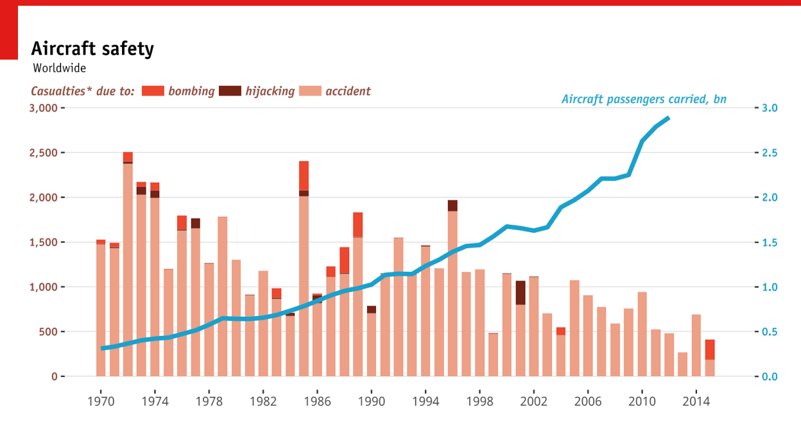
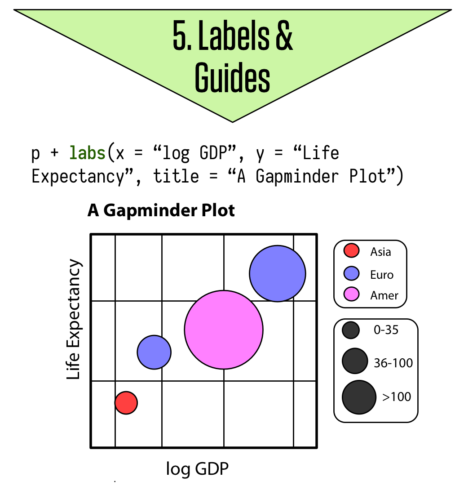

```{r setup, include=FALSE}
knitr::opts_chunk$set(message = FALSE)
knitr::opts_chunk$set(warning = FALSE)
library(tidyverse)
library(dygraphs)
library(flexdashboard)
library(plotly)
library(shiny)
library(shinydashboard)
library(DBI)
library(gapminder)
library(readxl)
library(httr)
library(rvest)
library(jsonlite)
library(nycflights13)
```

# Workshop Day 2

## Structure

- Day 2
  - Session 1: Visualization
  - Session 2: Collecting our own dataset
  - Session 3: Building our own dashboard
  - Session 4: Moving deeper and further

# Session 1: Visualizations

## Why Visualization is Important

> "At their best, graphics are instruments for reasoning about quantitative information."
[Tufte (1983)](https://books.google.de/books/about/The_Visual_Display_of_Quantitative_Infor.html?id=BHazAAAAIAAJ&redir_esc=y)

> "There is no statistical tool that is as powerful as a well-chosen graph."
[Chambers et al. (1983)](https://books.google.de/books/about/Graphical_methods_for_data_analysis.html?id=I-tQAAAAMAAJ)

> "Graphics should report the results of careful data analysis—rather than be an
attempt to replace it." [Tukey (1993)](https://www.jstor.org/stable/1390951?seq=1#page_scan_tab_contents)

## Goals

- Discovery goals:

    + Giving an overview—a qualitative sense of what is in a dataset
    + Conveying the sense of the scale and complexity of a dataset

- Communication goals:

    + Communication to self and others: Displaying information from the dataset in a readily understandable way
    + Telling a story
    + Attracting attention and stimulating interest

## Interpreting a graph depends on expectations

- If readers have a lot of background knowledge, they will view the graphic differently 
don't assume you already have the reader’s interest and involvement 
- Making graphics attractive can help motivate readers to understand them

## Graphics are part of a story

- A graphic does not live on its own
- There can be annotations, a legend, a title, a caption, accompanying text, an overall story, and a headline

## Seven Rules for Better Figures ([Rougier et al. 2014](http://journals.plos.org/ploscompbiol/article?id=10.1371/journal.pcbi.1003833))

1. Know your audience

    + Who is the figure for?
2. Identify your message

    + What is the role of the figure?
3. Captions are not optional

    + Always use captions, explaining how to read a figure
4. Use color effectively

    + Color can be your greatest ally or your worst enemy ([Tufte 1983](https://books.google.de/books/about/The_Visual_Display_of_Quantitative_Infor.html?id=BHazAAAAIAAJ&redir_esc=y))
    
## Seven Rules for Better Figures ([Rougier et al. 2014](http://journals.plos.org/ploscompbiol/article?id=10.1371/journal.pcbi.1003833))

5. Do not mislead the reader

    + A scientific figure is tied to the data
6. Avoid chartjunk

    + Get rid of any unnecessary non-data-ink
7. Get the right tool

    + Use R!

## ggplot2

R has several systems for making graphs, but `ggplot2` is one of the most elegant and most versatile. `ggplot2` implements the grammar of graphics, a coherent system for describing and building graphs.

## ggplot2 examples

```{r, out.width = "500px", echo = F, fig.align='center'}
knitr::include_graphics("img/weather.png")
```  

[Source](http://rpubs.com/bradleyboehmke/weather_graphic)

## ggplot2 examples

```{r, out.width = "500px", echo = F, fig.align='center'}
knitr::include_graphics("img/vaccination.png")
```  

[Source](https://benjaminlmoore.wordpress.com/2015/04/09/recreating-the-vaccination-heatmaps-in-r/)

## ggplot2 examples

```{r, out.width = "500px", echo = F, fig.align='center'}

``` 

[Source](https://www.quora.com/What-is-the-most-elegant-plot-you-have-made-using-ggplot2-in-R-Embed-the-code-if-possible)

## ggplot2 examples

```{r, out.width = "500px", echo = F, fig.align='center'}
knitr::include_graphics("img/map.png")
``` 

[Source](https://github.com/hrbrmstr/ggcounty)

## The grammar of graphics
- Each plot is made of layers. Layers include the coordinate system (x-y), points, labels, etc.
- Each layer has aesthetics (`aes`) including x & y, size, shape, and color.
- The main layer types are called geometrics(`geom`) and include
lines, points, etc.

## The grammar of graphics

A `ggplot` is build piece by piece

```{r, out.width = "300px", echo = F, fig.align='center'}
knitr::include_graphics("img/ggplot1.png")
``` 

[Source](http://socviz.co/make-a-plot.html#make-a-plot)

## The grammar of graphics

```{r, out.width = "300px", echo = F, fig.align='center'}
knitr::include_graphics("img/ggplot2.png")
``` 

## The grammar of graphics

```{r, out.width = "300px", echo = F, fig.align='center'}

``` 

## ggplot workflow

1. Tell the `ggplot()` function what your data are.

2. Tell `ggplot` what relationships we want to see.

3. Tell `ggplot` how you want to see the relationships in your data.

4. Add additional layers to the p object one at a time.

5. Use additional functions to adjust scales, labels, tick marks.

## Components of a ggplot2 graph

- data: Variables mapped to aesthetic attributes
- aesthetic: Visual property of the plot objects
- geom: Geometrical object used to represent data
- stats: Statistical transformations of the data
- scales: Values mapped to aesthetic attributes
- coord: Coordinate system
- facets: Subplots that each display one subset of the data

## Tidy data

`ggplot` requires data to be tidy, with observations in rows and variables grouped in _key_ | _value_ columns. 

| Person       |  treatmentA | treatmentB |
| ------------ | ----------- | ---------- |
| John Smith   |             | 2          |
| Jane Doe     | 16          | 11         |

| Person       |  treatment  | result     |
| ------------ | ----------- | ---------- |
| John Smith   | a           |            |
| Jane Doe     | a           | 16         |
| John Smith   | b           | 2          |
| Jane Doe     | b           | 11         |


## Mapping

We start creating a plot by telling `ggplot` what our data are and by storing the function in an object called `p`. For example, let's say we want to use the `gapminder` data to plot life expectancy against GDP per capita:  

```{r}
p <- ggplot(data = gapminder, 
            mapping = aes(x = gdpPercap,
                          y = lifeExp))
```

The `data` argument tells ggplot where to find the variables it is about to use. The `mapping = aes(...)` argument links variables to things you will see on the plot.

## Mapping

What happens if we just type `p` into the console at this point and hit return?

```{r, fig.width= 5, fig.height = 2.4}
p
```

## Choosing a geom

`p` already contains some information about out plot structure but we haven’t given it any instructions yet about what sort of plot to draw. We need to add a layer to the plot by using the `geom_` function:

```{r, fig.width= 5, fig.height = 2.4}
p + geom_point()
```

## Choosing a geom

Let's try a different `geom_` and see what happens:

```{r, fig.width= 5, fig.height = 2.4}
p + geom_smooth()
```

## Choosing a geom

The console tells you that `geom_smooth()` uses a method called `gam`, i.e. it fit a generalized additive model. Perhaps there are other methods that `geom_smooth()` understands. Let's add `method = "lm"` as an argument to geom_smooth() and fit a linear model:

```{r, fig.width= 5, fig.height = 2.3}
p + geom_smooth(method = "lm")
```

## Choosing a geom

If we want to see data points and a smoothed line together we simply add `geom_point()` to the plot:

```{r, fig.width= 5, fig.height = 2.4, message=FALSE}
p + geom_smooth() + geom_point()
```

## Adjusting the scales

GDP pc does not seem to be normally distributed. We can account for that and transform the x-axis from a linear to a log scale by adding the `scale_x_log10()` function. 


```{r, fig.width= 5, fig.height = 2.4, message=FALSE}
p + geom_smooth() + geom_point() + scale_x_log10()
```


## Adjusting the scales

The scale transformation is applied to the data before the smoother is layered on to the plot. There are a number of other scale transformations that you can use such as `scale_x_sqrt()` and `scale_x_reverse` and corresponding functions for y-axis transformations. 

Take some time to experiment with them to see what effect they have on the plot. Also, what happens if you put the `geom_smooth()` function before `geom_point()` and what does that tell you about how plot layers are drawn?


## Labels and titles

Having created an interesting plot, we could now polish it up with nicer axis labels and titles. For example, let's swap the scientific notation on the x-axis for something more meaningful such as US dollars. The labels on the tick-marks can be controlled through the `scale_` functions. You can supply your own functions are use the pre-made functions from the handy `scales` library.

## Labels and titles


```{r, fig.width= 5, fig.height = 2.4, message=FALSE}
p + geom_smooth() + geom_point() + 
  scale_x_log10(labels = scales::dollar)
```

## Labels and titles

We can adjust the axis labels and add plot titles using the `labs()` function:

```{r, fig.width= 5, fig.height = 2.4, eval = FALSE}
p + geom_point() +
  geom_smooth() + 
  scale_x_log10(labels = scales::dollar) +
  labs(x = "GDP Per Capita",
       y = "Life Expectancy in Years",
       title = "Economic Growth and Life Expectancy",
       subtitle = "Data points are country-years",
       caption = "Source: Gapminder.")
```

## Labels and titles

```{r, message = FALSE, echo = FALSE}
p + geom_point() +
    geom_smooth() + scale_x_log10(labels = scales::dollar) +
    labs(x = "GDP Per Capita",
         y = "Life Expectancy in Years",
         title = "Economic Growth and Life Expectancy",
         subtitle = "Data points are country-years",
         caption = "Source: Gapminder.")
```

## Aesthetics mapping

We can easily map variables in our dataset to aesthetics such size, color, shape, and so on. For example, to map color to `continent`:

```{r, fig.width= 5, fig.height = 2.4, message=FALSE}
p <- ggplot(data = gapminder, 
            mapping = aes(x = gdpPercap,
                          y = lifeExp,
                          color = continent))
```

## Aesthetics mapping
```{r, fig.width= 5, fig.height = 2.4, message=FALSE}
p <- ggplot(data = gapminder, 
            mapping = aes(x = gdpPercap,
                          y = lifeExp,
                          color = continent))
p + geom_point() + scale_x_log10()
```


## Aesthetics mapping

What's gone wrong with this code?

```{r, fig.width= 5, fig.height = 2.3}
p <- ggplot(data = gapminder, 
            mapping = aes(x = gdpPercap, y = lifeExp,
                          color = "blue"))
p + geom_point()
```

## Aesthetic mappings

`aes()` treated the word "blue" as though it were a variable, and since it could not find it in the dataset, it created it on the fly.  By default, ggplot shows all the points in the category “blue” and colors them using its default first-category hue … which is red.

## Aesthetic mappings

`aes()` is for mappings only and not to set properties to a particular value. If we want to set a property, we do it inside `geom_`:

```{r, fig.width= 5, fig.height = 2.3}
p <- ggplot(data = gapminder, 
            mapping = aes(x = gdpPercap, y = lifeExp))
p + geom_point(color = "blue")
```

## Aesthetic mappings

`geom_` can take many other arguments that will affect how the plot looks. Some, such as color and size, have the same name as mappable arguments. Others are specific arguments only available for the `geom_` function. Let's look at a few examples:

## Aesthetic mappings

Change the size

```{r, fig.width= 5, fig.height = 2.4}
p + geom_point(size = 0.8)
```

## Aesthetic mappings

Adjust transparency 

```{r, fig.width= 5, fig.height = 2.4}
p + geom_point(alpha = 0.3)
```

## Aesthetic mappings

Change the color of the smoother 

```{r, fig.width= 5, fig.height = 2.4, message = FALSE}
p + geom_point() + 
  geom_smooth(color = "orange")
```

## Aesthetic mappings per geom

Let's again map our `continent` variable to the color aesthetic. This time we also add a smoother.

```{r, eval = FALSE}
p <- ggplot(data = gapminder,
            mapping = aes(x = gdpPercap,
                          y = lifeExp,
                          color = continent))
p + geom_point() + 
  geom_smooth() + 
  scale_x_log10()
```

## Aesthetic mappings per geom

```{r, echo = FALSE, message = FALSE}
p <- ggplot(data = gapminder,
            mapping = aes(x = gdpPercap,
                          y = lifeExp,
                          color = continent))
p + geom_point() + 
  geom_smooth() + 
  scale_x_log10()
```


## Aesthetic mappings per geom

Both points and smoother are colored by continent. We can use `fill` inside `aes()` to color the interior of the smoother’s standard error ribbon:

```{r, eval = FALSE}
p <- ggplot(data = gapminder,
            mapping = aes(x = gdpPercap,
                          y = lifeExp,
                          color = continent,
                          fill = continent))
p + geom_point() + 
  geom_smooth() + 
  scale_x_log10()
```

## Aesthetic mappings per geom

```{r, echo = FALSE, message = FALSE}
p <- ggplot(data = gapminder,
            mapping = aes(x = gdpPercap,
                          y = lifeExp,
                          color = continent, 
                          fill = continent))
p + geom_point() + 
  geom_smooth() + 
  scale_x_log10()
```

## Aesthetic mappings per geom

Having 5 different smoothers makes the plot difficult to read. If we just want one line but keep the colored points we can map the aesthetics we want only the `geom_` functions that we want them to apply to:

```{r, eval = FALSE}
p <- ggplot(data = gapminder,
            mapping = aes(x = gdpPercap,
                          y = lifeExp))
p + geom_point(mapping = aes(color = continent)) + 
  geom_smooth() + 
  scale_x_log10()
```

## Aesthetic mappings per geom

```{r, echo = FALSE, message = FALSE}
p <- ggplot(data = gapminder,
            mapping = aes(x = gdpPercap,
                          y = lifeExp))
p + geom_point(mapping = aes(color = continent)) + 
  geom_smooth() + 
  scale_x_log10()
```

## Aesthetic mappings per geom

What happens when you map a continuous variable, such as population (`pop`), to color?

```{r, eval = FALSE}
p <- ggplot(data = gapminder,
            mapping = aes(x = gdpPercap,
                          y = lifeExp))
p + geom_point(mapping = aes(color = pop)) + 
  scale_x_log10()
```

## Aesthetic mappings per geom
```{r, echo = FALSE, message = FALSE}
p <- ggplot(data = gapminder,
            mapping = aes(x = gdpPercap,
                          y = lifeExp))
p + geom_point(mapping = aes(color = pop)) + 
  scale_x_log10()
```


## Group, facet, transform

There are a number of additional functions in `ggplot` that are frequently used to plot data. `group`, for examples, allows to learn more about the internal structure of your data (). Let's say we wanted to plot the trajectory of economic development over time for each country. How would we do that?  


## Group

What's gone wrong here?

```{r, fig.width= 5, fig.height = 2.3}
p <- ggplot(data = gapminder,
            mapping = aes(x = year,
                          y = gdpPercap))
p + geom_line()
```

## Group

`ggplot` does not know that the yearly observations in the data are grouped by country. We have to tell it:

```{r, fig.width= 5, fig.height = 2.3}
p + geom_line(aes(group = country))
```

## Facet

The plot we just made looks a little messy. To make the trend clearly we could _facet_ the data by a third variable and plot the results in separate panels. We use `facet_wrap()` to split our plot by `continent`:

```{r, eval = FALSE}
p <- ggplot(data = gapminder,
            mapping = aes(x = year,
                          y = gdpPercap))
p + geom_line(aes(group = country)) + 
  facet_wrap(~ continent)
```

## Facet

```{r, echo = FALSE}
p <- ggplot(data = gapminder,
            mapping = aes(x = year,
                          y = gdpPercap))
p + geom_line(aes(group = country)) + 
  facet_wrap(~ continent)
```

## Facet

We can also use the `ncol` argument to `facet_wrap()` to control the number of columns. We can add a smoother and a few cosmetic enhancements that make the graph a little more effective. Any geom that we include will be layered within each facet:

```{r, eval = FALSE}
p + geom_line(color="gray70", aes(group = country)) +
    geom_smooth(size = 1.1, method = "loess", se = FALSE) +
    scale_y_log10(labels=scales::dollar) +
    facet_wrap(~ continent, ncol = 3) +
    labs(x = "Year",
         y = "GDP per capita",
         title = "GDP per capita on Five Continents")
```


## Facet

```{r, echo = FALSE}
p + geom_line(color="gray70", aes(group = country)) +
    geom_smooth(size = 1.1, method = "loess", se = FALSE) +
    scale_y_log10(labels=scales::dollar) +
    facet_wrap(~ continent, ncol = 3) +
    labs(x = "Year",
         y = "GDP per capita",
         title = "GDP per capita on Five Continents")
```

## Facet

`facet_wrap()` is best used when you want a series of small multiples based on a single categorical variable. If you want to cross-classify some data by two categorical variables you should try `facet_grid()` instead.

## Plotting Distributions: Distributions of categorical data

```{r, fig.width= 5, fig.height = 2.3}
ggplot(data=diamonds) +
  geom_bar(mapping = aes(x = cut))
```

## Plotting Distributions: Distributions of continuous data

```{r, fig.width= 5, fig.height = 2.3}
ggplot(data=diamonds) +
  geom_histogram(mapping = aes(x = carat), 
                 binwidth = 0.5)
```

## Plotting Distributions: Boxplot

We can use `geom_boxplot()` to plot covariation between continuous and catagorical variables

```{r, fig.width= 5, fig.height = 2.3}
ggplot(data = mpg, aes(x = class, y = hwy, fill = class)) +
  geom_boxplot(aes(x=reorder(class, hwy,FUN = median), 
                   y = hwy)) +
  theme(legend.position = "none")
```

## Plotting Distributions: Tile Plot

We can use `geom_tile` to plot the covariation between two categorical variables

```{r, fig.width= 5, fig.height = 2.3}
diamonds %>% 
  count(color, cut) %>%  
  ggplot(mapping = aes(x = color, y = cut)) +
    geom_tile(mapping = aes(fill = n))
```

## Plotting Distributions: Scatter Plots

The easiest way to visualize the covariation between two continuous variables is to draw a scatterplot with `geom_point()`.

```{r, fig.width= 5, fig.height = 2.3}
p <- ggplot(data=gapminder, mapping = aes(x = gdpPercap, 
                                          y = lifeExp)) +
  geom_point() +
  scale_x_log10(labels = scales::dollar) +
  labs(x = "GDP Per Capita",
       y = "Life Expectancy in Years",
       title = "Economic Growth and Life Expectancy",
       subtitle = "Data points are country-years",
       caption = "Source: Gapminder.")
```

## Plotting Distributions: Scatter Plots

```{r, fig.width= 5, fig.height = 2.3}
p
```


## Saving and exporting ggplot objects

`ggsave()` is a convenient function for saving the last plot that you displayed. It also guesses the type of graphics device from the extension. This means the only argument you need to supply is the filename.

```{r, eval = FALSE}
ggsave("myplot.pdf") # save as pdf
ggsave("myplot.png", width = 4, height = 4) # save as png

```

## More theme packages

- [ggpubr](https://rpkgs.datanovia.com/ggpubr/) for publication-ready plots
- [ggthemes](https://jrnold.github.io/ggthemes/reference/index.html) for additional themes and scales, especially ones that match other software (Tableau)
- [hrbrthemes](https://github.com/hrbrmstr/hrbrthemes) my personal favorite theme package

## ggplot2 resources

- [General ggplot2 information](https://ggplot2.tidyverse.org/)
- [R Graphics Cookbook](http://www.cookbook-r.com/Graphs/index.html)
- [Data Visualization: A Practical Introduction](https://socviz.co/)
- [ggplot2: Elegant Graphs for Data Analysis](https://ggplot2-book.org/)
- [RStudio visual data primer](https://rstudio.cloud/learn/primers/3)

## Visualization Exercise

1. Read in the Game of Thrones data from `gog.xlsx` and inspect it
2. Create a scatterplot with the moral score on the x-axis and the physical score on the y-axis.
3. Set the alpha (transparency) of all points to .75
4. Add labels to the points
5. Fix label overlap
6. Color the points by gender
7. Turn off legend for text layer
8. Bonus: Split the chart up into separate charts for each family(loyalty group)


##  Break
Let's break for 10 minutes

# Session 2: Collection your own data

## Browsing vs. scraping

- **Browsing**
  * you click on something
  * browser sends request to server that hosts website
  * server returns resource (often an HTML document)
  * browser interprets HTML and renders it in a nice fashion

## Browsing vs. scraping

- **Scraping with R**
  * you manually specify a resource
  * R sends request to server that hosts website
  * server returns resource
  * R parses HTML (i.e., interprets the structure), but does not render it in a nice fashion
  * it's up to you to tell R which parts of the structure to focus on and what content to extract

## Online text data sources

- **web pages** (e.g. http://example.com)
- **web formats** (XML, HTML, JSON, ...)
- **web frameworks** (HTTP, URL, APIs, ...)
- **social media** (Twitter, Facebook, LinkedIn, Snapchat, Tumbler, ...)
- **data in the web** (speeches, laws, policy reports, news, ... )
- **web data** (page views, page ranks, IP-addresses, ...)


## Before scraping, do some googling!

- If the resource is well-known, someone else has probably built a tool which solves the problem for you.
- [ropensci](https://ropensci.org/) has a [ton of R packages](https://ropensci.org/packages/) providing easy-to-use interfaces to open data.
- The [Web Technologies and Services CRAN Task View](http://cran.r-project.org/web/views/WebTechnologies.html) is a great overview of various tools for working with data that lives on the web in R.

## Extracting data from HTML

For web scraping, we need to:

1. identify the elements of a website which contain our information of interest;
2. extract the information from these elements;

**Both steps require some basic understanding of HTML and CSS.** More advanced scraping techniques require an understanding of *XPath* and *regular expressions*.

## What's HTML?

**HyperText Markup Language**

* markup language = plain text + markups
* standard for the construction of websites
* relevance for web scraping: web architecture is important because it determines where and how information is stored

## Inspect the source code in your browser

**Firefox**
1. right click on page
2. select "View Page Source"

**Chrome**
1. right click on page
2. select "View page source"

**Safari**
1. click on "Safari"
2. select "Preferences"
3. go to "Advanced"
4. check "Show Develop menu in menu bar"
5. click on "Develop"
6. select "Show Page Source."


## CSS?

**Cascading Style Sheets**

* style sheet language to give browsers information of how to render HTML documents
* CSS code can be stored within an HTML document or in an external CSS file
* selectors, i.e. patterns used to specify which elements to format in a certain way, can be used to address the elements we want to extract information from
* works via tag name (e.g.,`<h2>`,`<p>`) or element attributes `id` and `class`

## Exercise

1. Complete the first 5 levels on [CSS Diner]("http://flukeout.github.io/")

## XPath

* XPath is a query language for selecting nodes from an XML-style document (including HTML)
* provides just another way of extracting data from static webpages
* you can also use XPath with R, it can be more powerful than CSS selectors

## Example

```{r, out.width = "500px", echo = F}
knitr::include_graphics("img/wikiTable.png")
```  


## Inspecting elements

```{r, out.width = "500px", echo = F}
knitr::include_graphics("img/inspect-element.png")
```  

## Hover to find desired elements

```{r, out.width = "500px", echo = F}
knitr::include_graphics("img/inspector.png")
```  


## `Rvest`

[rvest](https://github.com/hadley/rvest) is a nice R package for web-scraping by (you guessed it) Hadley Wickham.

- see also: https://github.com/hadley/rvest
- convenient package to scrape information from web pages
- builds on other packages, such as xml2 and httr
- provides very intuitive functions to import and process webpages


## Basic workflow of scraping with rvest

```{r}
# 1. specify URL
"http://en.wikipedia.org/wiki/Table_(information)" %>% 

# 2. download static HTML behind the URL and parse it into an XML file
read_html() %>% 

# 3. extract specific nodes with CSS (or XPath)
html_node(".wikitable") %>%

# 4. extract content from nodes
html_table(fill = TRUE)
```

\normalsize

## Selectorgadget

- [Selectorgadget](http://selectorgadget.com/) is a [Chrome browser extension](https://chrome.google.com/webstore/detail/selectorgadget/mhjhnkcfbdhnjickkkdbjoemdmbfginb?hl=en) for quickly extracting desired parts of an HTML page.

* to learn about it, use vignette("selectorgadget")

* to install it, visit http://selectorgadget.com/

## Selectorgadget

```{r, eval = FALSE}
url <- "http://spiegel.de/schlagzeilen"
css <- ".schlagzeilen-headline"
url_parsed <- read_html(url)
html_nodes(url_parsed, css = css) %>% html_text
```


## APIs

- API stands for *Application Programming Interface*
- defined interface for communication between software components
- *Web* API: provides an interface to structured data from a web service
- APIs should be used whenever you need to automatically collect mass data from the web
- it should definitely be preferred over web scraping

## Functionality of APIs

Web APIs usually employ a **client-server model**. The client – that is you. The server provides the *API endpoints* as URLs.

```{r, out.width = "500px", echo = F}

```  

## Functionality of APIs

Communication is done with request and response messages over *Hypertext transfer protocol (HTTP)*.

Each HTTP message contains a *header* (message meta data) and a *message body* (the actual content). The three-digit [HTTP status code](https://en.wikipedia.org/wiki/List_of_HTTP_status_codes) plays an important role:

- 2xx: Success
- 4xx: Client error (incl. the popular *404: Not found* or *403: Forbidden*)
- 5xx: Server error

The message body contains the requested data in a specific format, often JSON or XML.

## Examples of popular APIs

Social media:

- [Twitter](https://developer.twitter.com/)
- [Facebook Graph API](https://developers.facebook.com/docs/graph-api/) (restricted to own account and public pages)
- [YouTube (Google)](https://developers.google.com/youtube/)
- [LinkedIn](https://www.linkedin.com/developers/)

## Examples of popular APIs

Google (see [API explorer](https://developers.google.com/apis-explorer/)):

- [Cloud](https://cloud.google.com/) (Translation / NLP / Speech / Vision / ...)
- [Maps (now also part of cloud platform)](https://cloud.google.com/maps-platform/) (geocoding, directions, places, etc.)
- [Civic Information](https://developers.google.com/civic-information/) (political representation, voting locations, election results, ...)
- [Books](https://developers.google.com/books/)

## Examples of popular APIs

Other:

[Microsoft Face API](https://www.microsoft.com/cognitive-services/en-us/face-api), [Amazon Mechanical Turk API](https://docs.aws.amazon.com/AWSMechTurk/latest/AWSMturkAPI/Welcome.html), [Wikipedia](https://en.wikipedia.org/wiki/Help:Creating_a_bot#APIs_for_bots), etc.

For more, see [programmableweb.com](http://www.programmableweb.com/).

## API wrapper packages

- Working with a web API involves:
  - constructing request messages
  - parsing result messages
  - handling errors

- For popular web services there are already "API wrapper packages" in R:
  - implement communication with the server
  - provide direct access to the data via R functions
  - examples: *rtweet*, *ggmap* (geocoding via Google Maps), *wikipediR*, *genderizeR*

## Twitter

**Twitter has two types of APIs**

- REST APIs --> reading/writing/following/etc.

- Streaming APIs --> low latency access to 1% of global stream - public, user and site streams

- authentication via OAuth

- documentation at https://dev.twitter.com/overview/documentation

## Accessing the Twitter APIs

- To access the REST and streaming APIs, all you need is a Twitter account and you can be up in running in minutes!

- Simply send a request to Twitter’s API (with a function like `search_tweets()`) during an interactive session of R, authorize the embedded `rstats2twitter` app (approve the browser popup), and your token will be created and saved/stored (for future sessions) for you!

- You can obtain a developer account to get more stability and permissions.

## Twitter API subscriptions

Twitter provides [three subscription levels](https://developer.twitter.com/en/pricing):

- Standard (free)
    - search historical data for up to 7 days
    - get sampled live tweets
- Premium ($150 to $2500 / month)
    - search historical data for up to 30 days
    - get full historical data per user
- Enterprise (special contract with Twitter)
    - full live tweets

The *rate limiting* also differs per subscription level (number of requests per month).

## Use twitter in R

```{r, eval = FALSE}
library(rtweet)

## search for 1000 tweets using the #niewiedercdu hashtag
tweets <- search_tweets(
  "#iacaucus", n = 1000, include_rts = FALSE
)
```

Find out what else you can do with the `rtweet` package:
<https://github.com/mkearney/rtweet>

## Exercise

1. We want to get data from [abgeordnetenwatch.de](https://www.abgeordnetenwatch.de/). The site has an API, so technically there is no need to scrape anything. Load the package `jsonlite` into library.

2. Go to https://www.abgeordnetenwatch.de/api and figure our the syntax of their APIs.

3. Use the `fromJSON` function in `jsonlite` to load a JSON file via the API into R. Save the input as `aw_data`.

## Exercise solution

```{r, eval = FALSE}
library(jsonlite)
aw_data <- jsonlite::fromJSON("https://www.abgeordnetenwatch.de/api/parliament/bundestag/deputies.json")
```

# Session 3: Building our own dashboard

## Why use dashboards?

- R, it provides three core plotting systems:

    + base plots
    + lattice plots
    + ggplot2 plots

- writing codes for plotting graphs in R time & again can get tiring
- difficult to create an interactive visualization for story narration using above packages

## Goal of a dashboard

* Translate complicated data into a more readable, more understandable format for less technical people

* Dashboards allow non-data scientists to see the numbers that are important to them upfront and make connections based on their expertise

* Share your analysis (in an interactive manner) with the community

## `htmlwidgets`

A framework for creating HTML widgets that render in various contexts including the R console, 'R Markdown' documents, and 'Shiny' web applications.

`htmlwidgets` seamlessly bridges R and JavaScript. HTML widgets work just like R plots except they produce interactive web visualizations. 

There are over 30 packages on CRAN which provide htmlwidgets: 
[Available widgets](http://www.htmlwidgets.org/showcase_metricsgraphics.html)

## `htmlwidgets` example

```{r, eval = FALSE}
dygraph(nhtemp, main = "New Haven Temperatures") %>% 
  dyRangeSelector(dateWindow = c("1920-01-01", "1960-01-01"))
```

## Time-series data visualization

```{r, echo = FALSE}
dygraph(nhtemp, main = "New Haven Temperatures") %>% 
  dyRangeSelector(dateWindow = c("1920-01-01", "1960-01-01"))
```

## `flexdashboard`

* Ideal for publishing interactive JavaScript visualizations based on `htmlwidgets` (also works with standard base, lattice, and grid graphics).

* Flexible and easy to specify row and column-based layouts. Charts are intelligently re-sized to fill the browser and adapted for display on mobile devices.

* Storyboard layouts for presenting sequences of visualizations and related commentary.

## `flexdashboard` example

[Nuclear Waste Sites](https://beta.rstudioconnect.com/jjallaire/htmlwidgets-waste-sites/htmlwidgets-waste-sites.html)

## `Plotly`

* Allows to easily translate ggplot2 graphics to an interactive web-based version.

* The R package also provides high-level bindings for working directly with the `plotly.js` graphing library.

* [Plotly Cheatsheet](https://images.plot.ly/plotly-documentation/images/r_cheat_sheet.pdf)

## `ggplotly`

```{r, warning=FALSE, message=FALSE}
p <- ggplot(data = diamonds, aes(x = cut, fill = clarity)) +
            geom_bar(position = "dodge")
ggplotly(p)
```

## Choropleth map with `plot_ly`

```{r, eval = FALSE}
plot_ly(
type = 'choropleth',
locations = c('AZ','CA','VT'),
locationmode = 'USA-states',
colorscale = 'Viridis' ,
z = c(10 ,20 ,40 )) %>% 
layout(geo = list(scope = 'usa'))
```

## Choropleth Maps

```{r, echo = FALSE}
plot_ly(
type = 'choropleth',
locations = c('AZ','CA','VT'),
locationmode = 'USA-states',
colorscale = 'Viridis' ,
z = c(10 ,20 ,40 )) %>% 
layout(geo = list(scope = 'usa'))
```

## `Shiny`

`Shiny` is an R package that makes it easy to build interactive web apps straight from R. You can host standalone apps on a webpage or embed them in R Markdown documents or build dashboards.

Shiny Example 1: [Movie Explorer](https://shiny.rstudio.com/gallery/movie-explorer.html)

Shiny Example 2: [CRAN Downloads](https://jjallaire.shinyapps.io/shiny-crandash/)

## Let's build our own dashboard

# Session 4: Moving deeper and further

## Datacamp

[DataCamp](https://www.datacamp.com/) offers interactive R, Python, Sheets, SQL and shell courses.

```{r, out.width = "500px", echo = F}

``` 

## Coursera

[Coursera](https://www.coursera.org/) is an e-learning platform with great courses on data science.


```{r, out.width = "500px", echo = F}
knitr::include_graphics("img/Coursera.png")
``` 

## Kaggle

[Kaggle](https://www.kaggle.com/) is the world's largest data science and machine learning communities.

```{r, out.width = "500px", echo = F}
knitr::include_graphics("img/Kaggle.png")
``` 


